<div align="center">

# 🏋️ Musculator

**Un carnet de musculation qui tient dans une poche : programmes, séance guidée avec coach
vocal, démos animées, cartographie musculaire, nutrition et journal.**

[](https://react.dev)
[](https://vite.dev)
[](https://vite-pwa-org.netlify.app)


</div>

A mobile-first PWA for muscle-building strength training: personalized programs, guided
sessions with a rest timer, animated exercise demos and a French voice coach, a muscle map,
an exercise library, a nutrition journal, and a daily journal with an on-device "AI analysis"
of your training.

Built with React + Vite, installable and offline-capable (`vite-plugin-pwa`). All data —
profile, custom workouts, session history, food log — is stored locally (`localStorage`);
**there is no backend and nothing ever leaves the device**, except the food lookups you
trigger yourself and the optional AI analysis if you plug in your own key.

> 🇫🇷 The interface is entirely in French, as are the data fields. Code, comments and commits
> are in English.

---

## 📱 Aperçu

| 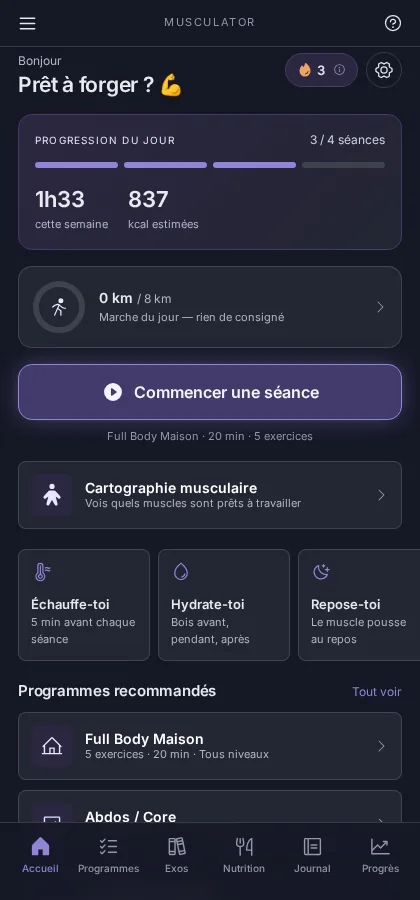 | 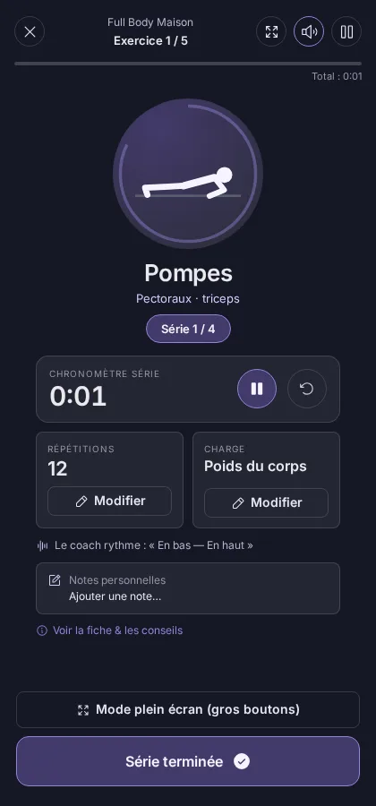 | 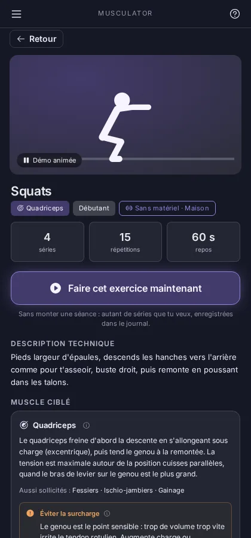 |
|:--:|:--:|:--:|
| **Accueil** — progression du jour, série de jours, séance en un geste | **Séance guidée** — phases effort/repos, chrono, coach vocal | **Fiche exercice** — technique complète et démo animée |

| 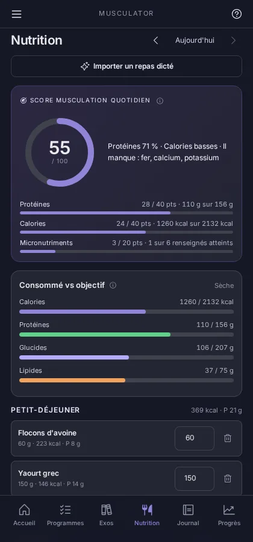 | 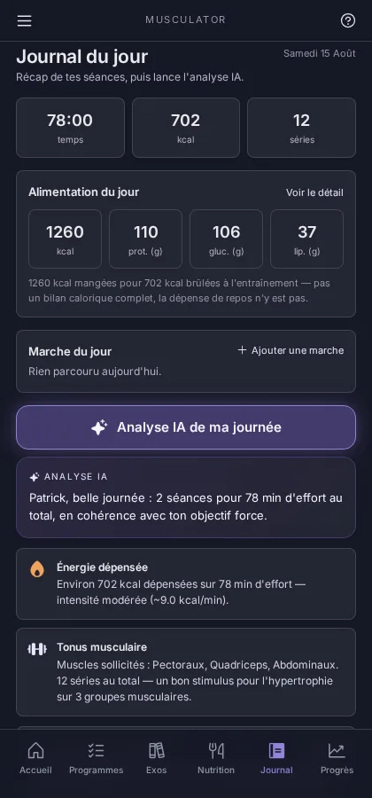 | 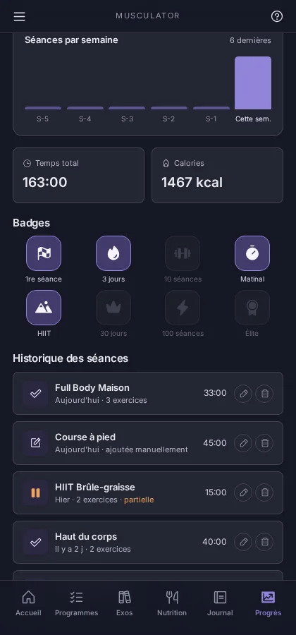 |
|:--:|:--:|:--:|
| **Nutrition** — Score Musculation Quotidien et macros vs objectif | **Journal** — séances du jour, alimentation et analyse IA | **Progrès** — série, badges et historique |

| 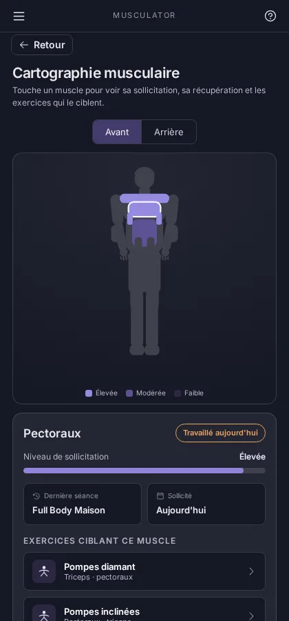 | 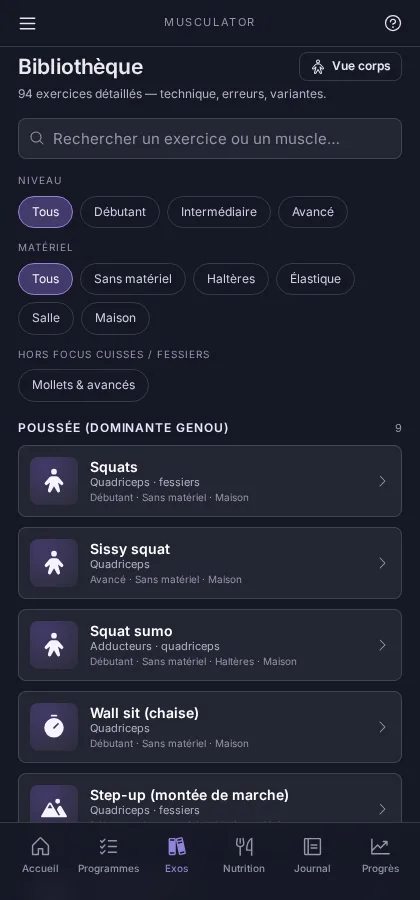 | 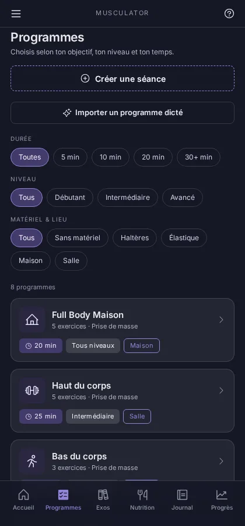 |
|:--:|:--:|:--:|
| **Cartographie** — sollicitation et récupération, calculées sur tes séances réelles | **Bibliothèque** — 104 exercices groupés par schéma de mouvement | **Programmes** — filtrables, plus un constructeur de séance |

<details>
<summary>🎨 <b>Et en thème clair</b></summary>

<br>

| 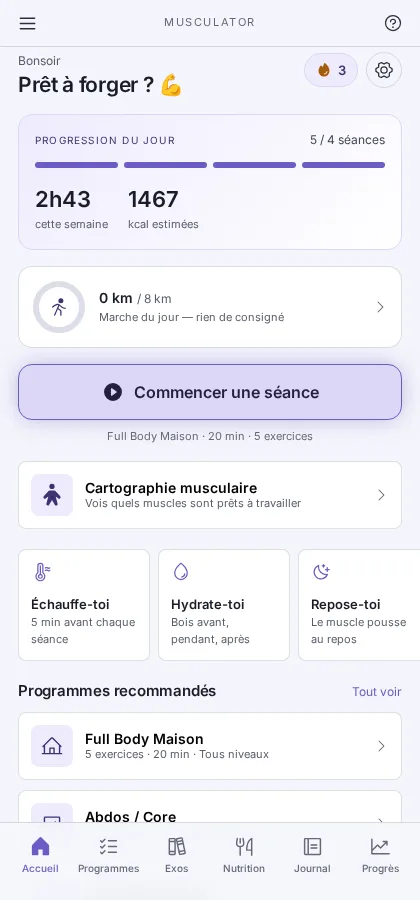 | 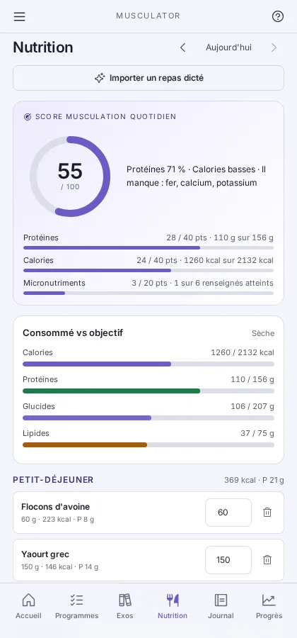 | 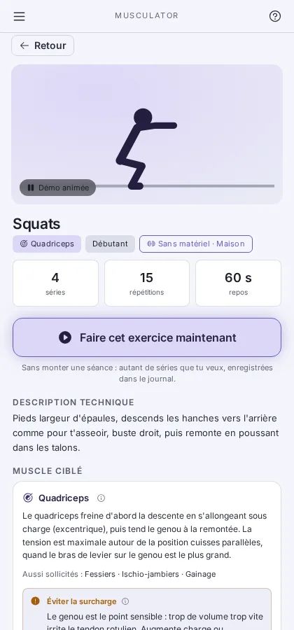 |
|:--:|:--:|:--:|
| Accueil | Nutrition | Fiche exercice |

</details>

---

## 🚀 Démarrer

```bash
npm install
npm run dev        # http://localhost:5173
npm run build      # build de production dans dist/
npm run preview    # sert le build sur :4173
npm run lint       # oxlint
```

Générateurs — à relancer quand leur source change, jamais à éditer à la main :

| Commande | Produit | Depuis |
|---|---|---|
| `npm run gen-icons` | `public/icons/*.png` | `scripts/gen-icons.mjs` |
| `npm run gen-prompt` | [`PROMPT-REPAS.md`](PROMPT-REPAS.md) | `src/lib/mealPrompt.js` |
| `npm run shots` | `docs/screenshots/*.webp` (la galerie ci-dessus) | un build servi sur `:4173` |

There's also a Playwright smoke script that walks the main flows and drops screenshots in
`/tmp/shot-*.png`. It has no npm script and expects a build being served on port 4173:

```bash
npm run build && npm run preview &
node scripts/smoke.mjs
```

It launches Chromium from a hard-coded `/opt/pw-browsers/chromium`; adjust `executablePath`
in the script if your Playwright browsers live elsewhere. `npm run shots` uses whatever
Playwright resolves by default and needs the same running preview.

---

## ✨ What's implemented

Every screen carries a slim top bar: a **menu** on the left and a contextual **help** button
on the right. The menu reaches the screens that otherwise hide behind a single button
somewhere (profile & settings, muscle map, workout builder) plus the voice toggle and the
medical disclaimer. The help sheet describes whatever is on screen — the overlay when one is
open, the tab underneath otherwise — and its content lives in `src/data/help.js`.

🌗 **Dark or light**, picked under *Mon profil & objectifs → Apparence*: Sombre (the default
and the app's original look), Clair, or Système to follow the phone. The palettes are the two
token blocks in `src/styles/tokens.css` — light inverts each ramp rather than shifting it, so
the whole UI themes itself without a per-component light variant — and `index.html` applies
the stored choice before first paint so a light-theme launch never flashes dark.

- 🏠 **Accueil** — today's progress ring, week streak, one-tap "Commencer une séance", quick
  tips, recommended programs, medical disclaimer.
- ⚡ **Exercice seul** — a big "Faire cet exercice maintenant" button on any exercise sheet
  starts a one-exercise session straight away: no program to build, as many sets as you
  want, logged in the journal like any other session. Meant for a quick set during a break
  rather than a full workout.
- ⏱️ **Séance guidée** — exercise/rest phases, per-set stopwatch, rest countdown (+15s/skip),
  editable reps/charge/notes per exercise, a fullscreen "big buttons" mode for a phone
  propped up next to you, an animated demo of the current exercise, and a French voice coach
  (Web Speech API) that calls out reps in rhythm and encouragement, per exercise.
- 🚪 **Sortie de séance** — closing a session offers to save what you have already done rather
  than discarding it; a partial session is logged from the sets actually performed.
- 📋 **Programmes** — filterable by duration/level/equipment, a workout builder to compose and
  save custom sessions (exercises, series, reps, charge, rest, order), and **"Importer un
  programme dicté"**: ask an assistant for a plan and each of its sessions becomes a custom
  workout. The prompt embeds all 104 exercises so the assistant picks from the catalogue rather
  than inventing — an invented exercise would have no animated demo, no voice cues and no
  place on the muscle map. A movement the catalogue lacks is replaced by the nearest one
  working the same muscle, and the preview says so before anything is saved.
- 📚 **Bibliothèque** — searchable exercise catalogue (104 exercises) grouped by movement
  pattern, with full technique sheets (setup, movement, breathing, common mistakes, safety
  tips, easier/harder variants), an animated demo of every movement, and a "Muscle ciblé"
  block explaining how the target muscle is actually loaded and what to watch so it isn't
  overworked.
- 🥗 **Nutrition** — barcode scanning and food search (Open Food Facts + a bundled offline
  generic table), a day/meal food journal, a live macro dashboard against targets derived
  from your profile, and the **Score Musculation Quotidien** tying the two together. Can
  import a Nutritor journal CSV or a meal you dictated to a chat assistant.
- 🧬 **Cartographie musculaire** — front/back muscle map over 13 muscle zones; sollicitation
  level and recovery state are derived from your real session history, not fixed demo
  numbers.
- 📓 **Journal & Analyse IA** — today's sessions and food, a free-text daily note, plus a
  structured training analysis (energy, muscle stimulus, progress toward your goal, what to
  do next), cached per day. See below. A session you did outside the app is logged after the
  fact with its own date and time; one already logged can be corrected or deleted.
- 🚶 **Marche** — kilometres count towards the day's expenditure the way a session does.
  Three ways in, because a backend-less PWA has no access to a background pedometer and does
  not pretend otherwise: type the distance, track a walk live over the Geolocation API (app
  open, screen on), or import a GPX trace or a CSV export from Strava / Apple Santé /
  Google Fit. Energy is `0.5 kcal × weight × km`, *net* of resting metabolism — and it is
  shown beside the intake rather than added to the calorie target, which already contains
  everyday activity through its activity multiplier. A walk is not a workout: it lives in its
  own `activityLog` slice, has its own badges, and never touches the training streak.
- 🏅 **Progrès** — streak, sessions/week chart, badges (unlock from real usage), and the full
  history, which is where a session from a past day is edited or removed. Editing covers
  *when* and *how long* only: what was actually performed — exercises, sets, muscles — is the
  record the muscle map, the badges and the analysis all read as fact, so it stays read-only.
  Every figure on the screen is a way in rather than a decoration: the session total opens the
  whole history, a chart bar filters it to that week, and the time and calorie totals expand
  into a breakdown (average, last 30 days, split per program). It also carries a second AI
  analysis — see below.

---

## 💪 Exercise catalogue

104 exercises. The 10 original upper-body/core movements came from the design prototype and
the 35 lower-body ones (thighs / glutes) were added on top; the rest closed the gaps the
dictated-programme import kept substituting for — chest, back, deltoids, biceps, triceps,
rotation and anti-rotation core work, and three families the catalogue had no entry for at
all: grip and forearms, spinal erectors, and the trapezius. The lower-body entries carry two
extra fields:

Use the helpers rather than filtering `EXERCISES` by hand: `coreExercises({ optionnels })`,
`groupByPattern(list)`, `exercisesByPattern({ optionnels })`, `exById(id)`.

---

## 🎞️ Animated demos

Every one of the 104 exercises has an animated demonstration, shown in its library sheet and
during a guided session — so you can always see the movement rather than read it.

`src/data/demos.js` holds keyframe poses for a stick-figure skeleton rendered by
`src/components/ExerciseDemo.jsx`; `src/lib/pose.js` does the forward kinematics, pose
interpolation and per-exercise viewBox framing (React-free, so poses can be solved outside
the app). A pose carries a hip position plus one angle per joint in a 100×100 viewBox;
frames loop cyclically, so a normal exercise is just `[top, bottom]`.

A demo also declares the equipment it is performed on, and the renderer draws it: a floor,
mat, pull-up bar or dip bars (`scene`), a bench/box/step or a wall (`props`), and moving
gear that tracks the body — dumbbells, a loaded bar or a kettlebell in the hands
(`weights`), an elastic anchored to a hand or ankle (`band` / `ankleBand`), an elastic
stretched between the legs (`legBand`), a ball at the knees or heels (`ball`), and a bar
across the hips (`hipLoad`). The full field reference is in the header of `demos.js`.

Loop timing defaults to the voice cadence (`CUES[id].beat × frames.length`) so the figure
moves in step with the spoken cues; isometric holds (wall sit, Copenhagen, ball squeeze)
set `cycle` explicitly. Every exercise has its own cue pair and tempo in `src/data/cues.js`,
so explosive work moves fast and eccentric work moves slowly, in speech and animation
alike. Readers who prefer less motion get the starting position and nothing moves — the
component honours `prefers-reduced-motion`.

---

## 🥗 Nutrition module

Three food sources behind one shape (`src/lib/food.js`), so a scanned product, a generic and
a hand-typed food are interchangeable:

- 🛒 **Open Food Facts** — barcode lookup and text search. The retry/timeout policy and the
  relevance ranking are ported from Nutritor's `openFoodFacts.ts`. Every fetched product is
  cached in `foodCache` so it can be re-added with no network. The whole cache is listed at
  the bottom of the search screen, alphabetically, and takes priority in search results.
- 🥦 **CIQUAL** (`src/data/ciqual.js`) — 3 167 generic French foods bundled with the app, so
  search works fully offline and covers foods that have no barcode. It also carries the
  micronutrients OFF usually lacks, which is what makes the score's third component work.
  It is loaded as a separate chunk the first time food search opens — it is bigger than the
  rest of the app — but is precached, so offline search still works.
- ✍️ **Manual entry** — always available, for home-made food.

🎙️ A fourth way in skips typing altogether: describe a meal out loud to Claude or ChatGPT and
paste back the JSON they answer with (*Nutrition → Importer un repas dicté*). The prompt to
give them ships with the app and is mirrored at [`PROMPT-REPAS.md`](PROMPT-REPAS.md). It asks
for a portion weight plus per-100 g values — the shape the log stores — so an imported
quantity stays editable and rescales like a scanned product. Nothing is written before a
preview showing what was parsed and what had to be guessed.

Assistants answer loosely, so the import is written to expect it: prose and code fences
around the object, English or French field names, a meal routed by its hour when unnamed.
When the model only *names* a food — ChatGPT tends to answer `{"food": "kiwi"}` and leave the
composition out — it is resolved against the CIQUAL table by `src/lib/ciqualMatch.js`. That
matcher is deliberately stricter than the search screen's: nobody picks from a list here, so
a wrong match is silently wrong data, and it answers confidently or not at all — a food it
cannot place is dropped and named in a warning rather than logged empty. What it does resolve
shows the table entry it used, since CIQUAL has no plain "chocolat noir" and cannot tell
cooked rice from raw.

Barcode scanning uses the native `BarcodeDetector` where it exists (Chrome/Edge on Android)
and falls back to `@zxing/browser` elsewhere, which covers iOS Safari and Firefox. zxing is
loaded on demand and kept out of the precache, so browsers with the native API never
download it. The camera needs a secure context — over plain HTTP the scanner says so and
hands over to the manual barcode field.

### 🎯 Score Musculation Quotidien (/100)

`src/lib/dailyScore.js`, weighted from `src/data/nutrition.js`:

| Composante | Poids | Règle |
|---|---|---|
| Protéines | 40 | `min(consommé / cible, 1) × 40` |
| Calories | 40 | plein dans une bande de ±10 %, puis décroissant avec l'écart relatif |
| Micronutriments | 20 | part des micronutriments **renseignés** ayant atteint leur seuil |

A micronutrient nobody logged data for is *unknown*, not zero. Below half the list known, the
component is reported as "données insuffisantes" and **its weight leaves the denominator** —
the day is scored out of 80 rather than punished for Open Food Facts' gaps.

Targets come from the training profile the app already collects (Mifflin-St Jeor scaled by
the weekly training frequency), shifted by a nutrition goal that is deliberately separate
from the training objective — you can train for force while cutting. Four goals: *Prise de
masse*, *Recomposition*, *Maintien*, *Sèche*. Recomposition — losing fat and building muscle
at the same time — has its own numbers rather than borrowing a neighbour's, since Maintien
asks too little protein to build while losing and Sèche's deficit is too deep to build at
all; it pairs a light 5 % deficit with 2 g of protein per kilo. Each goal explains itself
under the picker. Each of the four
(calories, protein, carbs, fat) can also be set by hand under *Mon profil & objectifs →
Objectifs quotidiens*; the computed value stays visible as the field's placeholder, so an
override is never a one-way door.

---

## 🤖 About the "Analyse IA"

Two analyses, each with two interchangeable engines.

The **journal's** one reads today. The **progress** one (*Progrès → Analyser mes progrès*)
reads the last four weeks against the four before them, and asks a different question: is what
you actually do taking you towards what you said you wanted? It is framed by the profile's
objectives — objectif principal, zones prioritaires, objectif and daily nutrition targets —
and takes any declared constraint or injury into account. Priority zones are compared against
the muscles your sessions really worked, so "Dos fait partie de tes priorités mais n'a pas été
travaillé depuis 28 jours" is a measurement, not a nudge. A theme with no data is reported as
unmeasured and its weight leaves the score, rather than counting as a failure.

Both share the same two engines and the same output shape, so nothing downstream can tell
which one answered:

- 📴 **On-device (default).** `src/lib/analysis.js` computes a structured, personalized
  analysis from your profile and session log. No key, no network, works offline.
- ☁️ **OpenRouter (optional).** Add your own key and pick a free model under *Mon profil &
  objectifs → Analyse IA*, and that model writes the analysis instead. The free line-up is
  fetched live from OpenRouter — free is decided from the price, not the `:free` id suffix —
  so the list never goes stale, and audio/music models are filtered out since they cannot
  answer a chat completion.

The result is cached per day, so it survives a reload and is not recomputed — nor re-billed —
until a new session invalidates it. If an OpenRouter call fails for any reason — bad key,
rate limit, malformed JSON — the app falls back to the on-device engine and says so rather
than leaving you with nothing.

> ⚠️ **About the key:** there is no backend, so the key is stored in `localStorage` on the
> device and sent straight from the browser to OpenRouter. Anyone with access to the device
> can read it. Use a key you are willing to expose that way, and set a spend limit on it.

---

## 💾 Backups

Everything lives in `localStorage` on one device, so *Mon profil & objectifs → Sauvegarde de
mes données* exports every persisted slice to a JSON file and reads one back — merged into
what is already there (logs unioned by entry id) or replacing it wholesale, after showing what
the file contains. The OpenRouter key is deliberately left out: a backup is a file people mail
to themselves. Export goes through the share sheet first, since an installed iOS app often
ignores a download link.

## 🔄 Updating an installed app

A PWA on a home screen is reopened, not reloaded, so a fresh deploy can sit installed in the
background while the old code keeps running. *Mon profil & objectifs → Version & mise à jour*
therefore shows **which build is running** — commit and build time, stamped in at build time
from Netlify's `COMMIT_REF` — next to a button that checks the server, installs what it finds
and restarts onto it. A banner offers the same as soon as an update has installed, and the app
re-checks every time it returns to the foreground. It never updates during a workout: applying
reloads the page, and a running session lives in memory only.

## 🗂️ Project layout

```
src/
  data/        exercise/program/badge/muscle/cue/demo catalogues (static content)
  lib/         pure helpers: formatting, streak/muscle-stat derivation, pose
               kinematics, voice, theme, food, analysis
  state/       single Context + reducer store, localStorage-backed
  components/  shared chrome (tab bar, banners, modals), the demo renderer,
               and ui/ primitives
  screens/     the 6 tab screens
  overlays/    full-screen views pushed on top of a tab (exercise sheet, workout, etc.)
docs/
  screenshots/ the gallery above, regenerated by `npm run shots`
```

Working on this repo with Claude Code? [`CLAUDE.md`](CLAUDE.md) holds the architecture notes
and the invariants that no tooling enforces.

---

## ⚕️ Portée

Musculator donne des conseils d'entraînement et de nutrition. Il ne pose aucun diagnostic et
ne remplace pas l'avis d'un professionnel de santé — l'avertissement est affiché au premier
lancement et reste accessible depuis le menu.

## 🌱 Origin

This app was implemented from a Claude Design prototype handoff (see `chats/` for the
original design conversation and `project/` for the exported HTML/CSS/JS prototype it was
built from).
